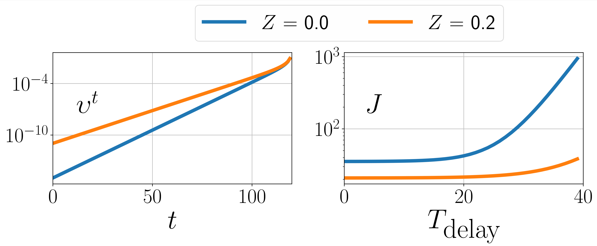

## Control Of Epidemic Spreads Via Testing And Lock-Down

Testing and lock-down are interventions that can combat the spread of an infectious disease. Testing is a targeted instrument that permits the isolation of infectious individuals. Lock-down, on the other hand, is blunt and restricts the mobility of all people. In this paper, we present a compartmental epidemic model that accounts for the impact of lock-down and different kinds of testing, motivated by the nature of the ongoing COVID-19 outbreak. We consider the testing of symptomatic, contact traced, and randomly chosen asymptomatic populations. Using the model, we first characterize static mobility levels and testing requirements that can dampen the spread asymptotically. We then characterize a threshold-type optimal lock-down policy that minimizes the social impact of an epidemic, modeled via a sum of infection and lockdown costs. Our results are contextualized with realistic parameter values for COVID-19.

Download the [paper](http://boses.ece.illinois.edu/files/COVID19_testlockdown.pdf).

Access the [code](/Notebooks/lockdown_cdc.ipynb).

**Figure 1. Our compartmental model**

**Figure 2. Numerical experiments with
    *T = 120* days, *αI = 0.5, αS = 0.08, β0 = 0.9, γ = 1/13, ς = 15, Fmin= 0.6* and *U0 = 10-4*. Plot on the left shows the optimal infection threshold *υt*. Plot on the right depicts the costs *J* obtained by implementing the optimal control policy with a delay.**

**Figure 3. Plot portrays *Ut* with and without contact tracing for two different values of *Z*.**

